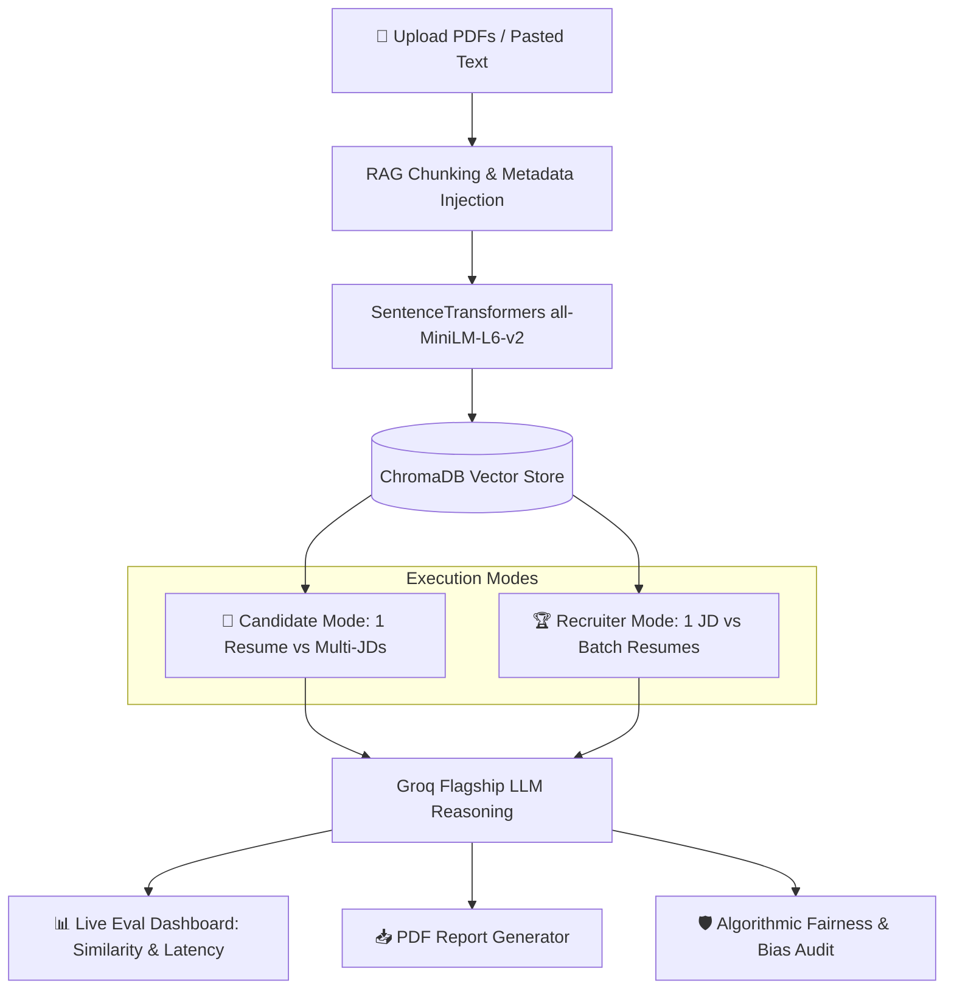

# 🎯 Fitcheck - Enterprise Multi-Document RAG & Candidate Screening Engine

🚀 **Live App Link**: [Fitcheck - Multi-Document RAG Candidate Screening](https://fitcheck-rag.onrender.com/)

[](https://fitcheck-rag.onrender.com/)
[](https://fastapi.tiangolo.com)
[](https://react.dev)
[](https://vitejs.dev)
[](https://www.trychroma.com)
[](https://groq.com)
[](https://opensource.org/licenses/MIT)

> **Fitcheck** is an advanced Multi-Document Retrieval-Augmented Generation (RAG) platform designed for **Job Seekers** and **Recruiting Teams**. Powered by dense vector search (`all-MiniLM-L6-v2`), ChromaDB vector store, Groq ultra-fast LPU inference, ReportLab PDF export, and an automated Algorithmic Fairness pre-screening scanner.

🌐 **Try the Live App Online**: [https://fitcheck-rag.onrender.com/](https://fitcheck-rag.onrender.com/)

---

## 🌟 Key Highlights & System Capabilities



### 1. 🎯 Candidate Mode (1 Candidate Resume vs. Multiple Job Descriptions)
* **Cross-JD Conflict Radar**: Automatically detects and surfaces contradictory requirements across uploaded roles (e.g., conflicting tech stacks, remote vs on-site discrepancies, differing experience years).
* **Skill Gap Radar**: Identifies missing frameworks, hard vs soft skill deficits, and generates concrete resume improvement suggestions.
* **Confidence & Grounding Transparency**: Computes real-time Cosine Similarity with color-coded badges (`🟢 High Confidence` vs `🟡 Moderate`) and expandable chunk-level source verification quotes.

### 2. 🏆 Recruiter Mode (1 Target Job Description vs. Multi-Candidate Resumes)
* **Automated Batch Leaderboard**: Evaluates and ranks candidate resumes from best to weakest fit ($0-100\%$) against the target role requirements.
* **Granular Hiring Verdicts**:
  * 🥇/🥈/🥉 Top Pick, Shortlisted, Consider, or Skills Mismatch verdicts.
  * **🎯 Why to Select**: Distinct strengths, relevant projects, and tool proficiencies.
  * **⚠️ Deficits / Gaps**: Specific missing requirements explaining why a candidate ranked lower.
  * **💡 Interview Strategy**: Tailored technical deep-dive questions designed for the interview panel.
* **Recruiter Follow-up Deep Dives**: Conversational follow-up Q&A over the entire candidate pool (e.g., *"Who has more hands-on Kubernetes experience?"*).

### 3. 📊 RAG Reliability & Evaluation Dashboard
* **System Observability Layer**: Real-time telemetry monitoring query health, retrieval precision, and round-trip inference latency.
* **Aggregated Trust Metrics**:
  * Total queries evaluated across active sessions.
  * Mean Cosine Similarity ($0.0 - 1.0$) using dense vector embeddings.
  * High Confidence Rate ($\ge 0.70$ similarity threshold).
  * Round-trip latency tracking (ms) between vector search and Groq LLM inference.
  * Visual segmented distribution bar (High / Moderate / Low).
  * Chronological query audit table with timestamps, query focus, mode, similarity %, and response time.

### 4. 📥 Export as Professional PDF Reports
* Built using **ReportLab** (pure Python, zero external binary dependencies).
* **Candidate Fit Report**: Includes candidate name, target roles, similarity score, JD contradiction banner (if present), and clause-by-clause requirement breakdown.
* **Recruiter Leaderboard Report**: Includes target role summary, Algorithmic Fairness Notice, ranked candidate table with match scores, select/reject rationales, and tailored interview strategy.

### 5. 🛡️ Algorithmic Fairness & Pre-Screening Bias Audit
* **EEOC & Compliance Aware**: In accordance with modern algorithmic hiring standards (e.g., NYC Local Law 144), resumes are audited for unsolicited protected demographic signals:
  1. `Age / Date of Birth`
  2. `Gender / Pronouns`
  3. `Marital & Family Status`
  4. `Photograph References`
  5. `Nationality, Religion & Caste`
* **Objectivity Mandate**: Flags markers for transparency and enforces strict LLM system constraints to evaluate solely on objective technical skills, projects, and work history.

---

## 🏗️ Project Architecture & Directory Structure

```text
Fitcheck/
├── api_server.py           # FastAPI REST API endpoints & route handlers
├── rag_engine.py           # Multi-Document RAG core, chunking, ChromaDB, Groq LPU
├── eval_stats.py           # Real-time evaluation telemetry & trust metrics store
├── export.py               # Pure-Python ReportLab PDF export engine
├── fairness_audit.py       # Demographic pre-screening & bias audit regex scanner
├── run_api.py              # Uvicorn entrypoint script
├── requirements.txt        # Backend dependencies
├── sample_resume.pdf       # Sample Candidate Resume for instant demo testing
├── sample_jd_senior.pdf    # Sample Senior Role JD
├── sample_jd_junior.pdf    # Sample Junior Role JD
│
└── frontend/               # Modern React + Vite Web Application
    ├── src/
    │   ├── App.jsx         # Full interactive UI (Candidate, Recruiter, Eval Dashboard)
    │   ├── main.jsx        # React root entry
    │   └── index.css       # Custom design system with glassmorphism & dark theme
    ├── package.json        # Frontend dependencies
    └── vite.config.js      # Vite configuration
```

---

## ⚡ Quickstart & Local Setup

### Prerequisites
* **Python**: 3.10+
* **Node.js**: 18+
* **Groq API Key**: Obtain a free API key from [Groq Console](https://console.groq.com)

### 1. Backend Setup

```bash
# Clone the repository
git clone https://github.com/AppleYT9/Fitcheck-RAG-.git
cd Fitcheck-RAG-

# Create and activate a Python virtual environment
python -m venv venv
# On Windows:
.\venv\Scripts\activate
# On macOS/Linux:
source venv/bin/activate

# Install dependencies
pip install -r requirements.txt

# Configure your Groq API Key
# Create a .env file with:
GROQ_API_KEY=your_groq_api_key_here
```

Start the FastAPI server:
```bash
python run_api.py
```
* Backend will be live at: **`http://localhost:8000`**
* Interactive Swagger Docs: **`http://localhost:8000/docs`**

---

### 2. Frontend Setup

In a new terminal window:

```bash
cd frontend

# Install Node dependencies
npm install

# Start the Vite development server
npm run dev
```
* Open your browser and navigate to: **`http://localhost:5173`**

---

## 📡 REST API Reference

| Endpoint | Method | Description |
| :--- | :---: | :--- |
| `/api/index-documents` | `POST` | Ingests and indexes 1 Resume + Multi-JDs into ChromaDB |
| `/api/load-sample` | `POST` | Auto-indexes built-in sample resume & JDs for 1-click demo testing |
| `/api/analyze` | `POST` | Runs grounded RAG retrieval, cosine similarity, conflict check & LLM reasoning |
| `/api/recruiter/rank` | `POST` | Batch screens candidate resumes against 1 JD, applies fairness audit & generates leaderboard |
| `/api/eval-stats` | `GET` | Returns real-time system metrics (total queries, avg similarity, latency, distribution) |
| `/api/export-report` | `POST` | Streams generated PDF reports for Candidate Fit or Recruiter Leaderboard |

---

## 🧪 Testing & Verification

Run the automated backend test suites:

```bash
# Test complete RAG indexing, retrieval & conflict detection
python test_jd_fit.py

# Test all backend modules (eval_stats, export, fairness_audit)
python -c "import export, eval_stats, fairness_audit, api_server; print('All modules verified!')"
```

---

## 🤝 Contributing & License

Contributions, issues, and feature requests are welcome!
Distributed under the **MIT License**.
